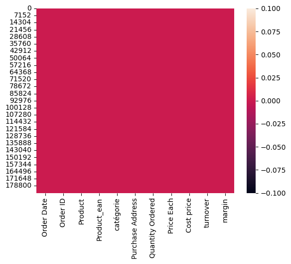

# Laporan Proyek Machine Learning
### Nama : Rizan Fauzi Rahman
### Nim : 211351129
### Kelas : Pagi B

## Domain Proyek
Proyek ini bertujuan untuk mengidentifikasi dan memahami berbagai segmen pelanggan berdasarkan perilaku pembelian mereka, seperti pelanggan setia, pelanggan yang berbelanja sesekali, dan pelanggan baru.Tujuan proyek ini adalah untuk membangun model prediksi penjualan berdasarkan data historis, sehingga Anda dapat merencanakan persediaan dan pemasaran dengan lebih baik.Dalam domain ini, Anda dapat mencoba mengidentifikasi harga yang optimal untuk produk Anda berdasarkan data harga dan penjualan sebelumnya.

## Business Understanding
Proyek ini berfokus pada analisis data penjualan ritel untuk meraih pemahaman mendalam tentang performa penjualan, dan perilaku pelanggan. Data penjualan yang tersedia mencakup informasi penjualan dari tahun-tahun sebelumnya, termasuk detail produk, dan tanggal penjualan.

### Problem Statements
- mengidentifikasi produk terlaris berdasarkan volume penjualan atau pendapatan.

### Goals
Tujuan ini mungkin berfokus pada identifikasi cara-cara untuk meningkatkan pendapatan atau penjualan produk atau layanan tertentu.Mungkin anda ingin mengetahui produk apa yang paling laris di pasar.Juga dapat menentukan apakah harga produk berpengaruh pada penjualan dan mencari tahu apakah ada kesempatan untuk mengoptimalkan harga.

 ### Solution statements
 Penting untuk merinci dan menyesuaikan Problem Statement yang akan membantu Anda memandu analisis data, menentukan metode yang tepat, dan menghasilkan wawasan yang bermanfaat untuk bisnis Anda.

 ## Data Understanding
 Tahap ini memberikan fondasi analitik untuk sebuah penelitian dengan membuat ringkasan (summary) dan mengidentifikasi potensi masalah dalam data.

 https://www.kaggle.com/datasets/aemyjutt/salesdata/data

 ### Variabel-variabel pada Heart Failure Prediction Dataset adalah sebagai berikut:
1. Order Date(Tanggal Pemesanan) = object
2. Order ID(Id Pemesanan) = int64
3. Product(Produk) = object
4. Product ean(Produk Ean) = float64
5. categorie(Kategori) = object 
6. Purchase Address(Alamat Pembelian) = object 
7. Quantity Ordered(Kuantitas yang dipesan) = int64  
8. Price Each(Harga Masing-Masing) = float64
9. Cost price(Biaya) = float64
10. turnover(Pergantian) = float64
11. margin(Batas) = float64

## Data Preparation
## Data Collection
Data ini merupakan koleksi informasi yang berharga dan mencangkup riwayat penjualan,detail product dan tanggal penjualan.Data tersebut dikumpulkan dari catatan penjualan beras hingga pasar-pasar lainnya.Data ini berperan penting dalam upaya penjualan dan pemahaman faktor-faktor yang ada dipasar lainnya.

### Data Discovery And Profiling
Pertama tama kita harus menginport Library-library yang dibutuhkan
``` bash
import pandas as pd
import numpy as np
import matplotlib.pyplot as plt
import seaborn as sns
from sklearn.model_selection import train_test_split
from sklearn.linear_model import LinearRegression
```
Lanjut dengan memeasukan dataset dan untuk melihat 5 data diurutan paling atas
``` bash
df = pd.read_csv('sales_data.csv')
df.head()
```
Melihat tipe data yang digunakan
``` bash
df.info()
```
Menuat peta panas dan  untuk memberikan pandangan visual tentang di mana data yang hilang berada dalam DataFrame.

 <br>

Untuk Cek detail informasi dari dataset
``` bash
df.describe()
```
selanjutnya lakukan seleksi dengan memisahkan mana saja atribut dan fitur yang akan 
dijadikan sebagai label.
``` bash
features = ['Product_ean', 'Price Each', 'Order ID', 'Quantity Ordered']
x = df[features]
y = df['margin']
x.shape, y.shape
```
Hasilnya : ((185950, 4), (185950,))

Lanjut langkah ini men split data testing dan data training
``` bash
from sklearn.model_selection import train_test_split
x_train,x_test,y_train,y_test = train_test_split(x,y,test_size=0.2,random_state=2)
y_test.shape
```
Hasilnya : (37190,)

Selanjutnya membuat regresi Linear
``` bash
from sklearn.linear_model import LinearRegression
lr = LinearRegression()
lr.fit(x_train,y_train)
predik = lr.predict(x_test)
```

Untuk mengevaluasi data
``` bash
y = lr.score(x_test, y_test)
print('Akurasi Model Regresi Linier:', y)
```
Hasilnya : Akurasi Model Regresi Linier: 0.9939195048015663

Membuat inputan Regresi Linear
``` bash
#Product ean = 2.113973e+12	, Price Each = 149.99 , Order ID = 141234 , Quantity Ordered = 1
inputan = np.array([[2.113973e+12, 149.99, 141234, 1]])
prediksi = lr.predict(inputan)
print('sales :', prediksi)
```
Hasilnya : sales : [91.05752142]

## Deployment
-Link Kagle (https://www.kaggle.com/datasets/aemyjutt/salesdata)
-Link Github (https://github.com/RizanFauziRahman/mesinlearning)
-Link Stramlit (https://mesinlearning-8vym2wjkd94naqbkuwm5sz.streamlit.app/)
